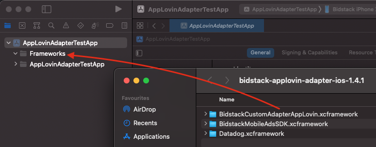
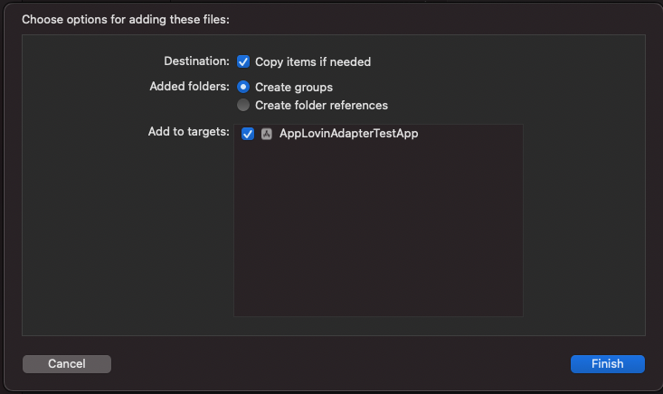
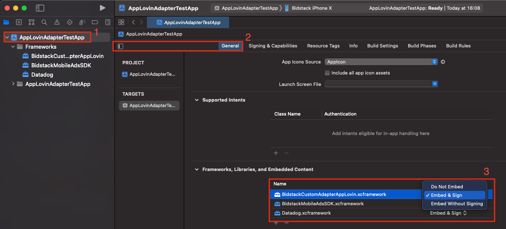
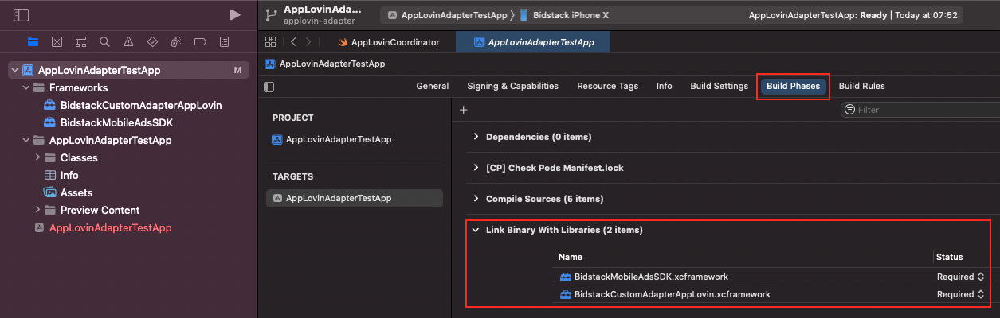

# Bidstack AppLovin Adapter iOS installation guide

The Bidstack AppLovin Adapter for iOS allows you to display Interstitial and Rewarded ads in your app through AppLovin.

The adapter supports iOS 10 and up and AppLovinSDK 11.3.0 and up.

## Table of contents

- [Prerequisites](#Prerequisites)
- [Integration](#Integration)
- [Supported versions](#Supported-versions)

## Prerequisites

Required: iOS version 10+

Required: If you're planning to integrate adapter manually, then you need to download **BidstackCustomAdapterAppLovin.xcframework** and **BidstackMobileAdsSDK.xcframework** provided by Bidstack.

Before integrating the adapter you will need to set up the Bidstack network on your AppLovin account as documented [here](https://dash.applovin.com/documentation/mediation/ios/mediation-setup/custom-sdk) and integrate the AppLovin SDK as documented [here](https://dash.applovin.com/documentation/mediation/ios/getting-started/integration).

#### Configure AppLovin MAX account settings
1. When prompted for `Network Type` choose `SDK`
2. In `Custom Network Name` field enter `Bidstack`
3. In `iOS Adapter Class Name` enter `AppLovinBidstackMediationAdapter`

**Note**: You may need to wait several minutes until AppLovin SDK will recognize Bidstack Adapter.

You will need to gather API key and ad unit ID's which can be obtained in [AdConsole](https://console.bidstack.com/auth/login).
Once you have obtained the credentials, set them up in your AppLovin account as documented
[here](https://dash.applovin.com/documentation/mediation/unreal/mediation-setup/custom-sdk#step-2.-enable-the-custom-sdk-network).

When prompted for `App Settings`:
1. `App ID` is the API key you retrieved from AdConsole
2. `Placement ID` is `Ad unit ID` you retrieved from AdConsole

## Integration 

There are two ways how you can integrate **BidstackCustomAdapterAppLovin** into your project - using cocoapods or adding xcframeworks manually. 

### 1. Using cocoapods

Add to your podfile:
`pod 'BidstackCustomAdapterAppLovin', '~> 1.1.0'`

That's it! Now you can `pod install` from your Terminal and **BidstackCustomAdapterAppLovin** and **BidstackMobileAdsSDK** will be installed automatically. No additional steps needed.

### 2. Add xcframeworks manually

#### 1. Create **Frameworks** folder

First of all, double check if your Xcode project contains a **Frameworks** folder in project navigator. If it doesn’t, you have to create one. The **Frameworks** folder is not added by default in latest Xcode and it’s a good practice to keep your frameworks there.

#### 2. Add **BidstackCustomAdapterAppLovin.xcframework** and **BidstackMobileAdsSDK.xcframework** to Frameworks folder

Drag and drop both frameworks from Finder into the **Frameworks** folder. Make sure that the destination of drag is just under the **Frameworks** folder:

Then, make sure the following options are selected for adding files. Both “Copy items if needed” and “Create groups” should be checked and selected. Click Finish.

#### 3. Embed **BidstackCustomAdapterAppLovin.xcframework** and **BidstackMobileAdsSDK.xcframework** in project's target

In order to make sure that the framework will get copied to your app’s binary, follow these steps:

1. Navigate to your project settings by clicking on it in the project navigator. 
2. Make sure that your target is selected and General tab is open.
3. Select “Embed & Sign” for your newly added **BidstackCustomAdapterAppLovin.xcframework** and **BidstackMobileAdsSDK.xcframework**

#### 4. Link **BidstackCustomAdapterAppLovin.xcframework** and **BidstackMobileAdsSDK.xcframework** with your project

Navigate to the Build Phases tab, disclose the “Link Binary With Libraries” list and make sure your framework is included in the list. It should already be included by default after following the steps above, however in case it’s not – click on the + button and add it.

Then make sure both framework Status is **Required**

### The **BidstackCustomAdapterAppLovin.xcframework** and **BidstackMobileAdsSDK.xcframework** is now fully added and integrated with your Xcode project. No additional setup is needed.

## Supported versions

Supported **AppLovinSDK** versions: 11.3.0 and up

Supported **iOS** versions: version 10+

