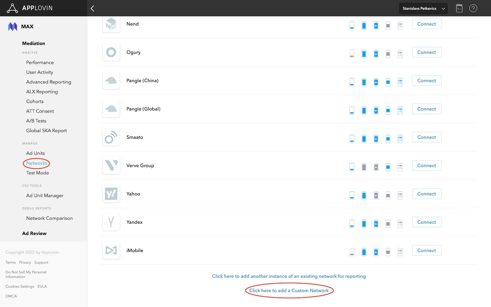
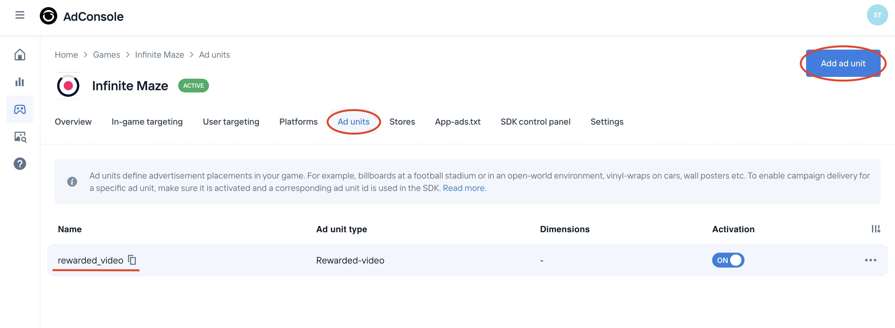

# Bidstack AppLovin Adapter Installation Guide for iOS

The Bidstack AppLovin Adapter for iOS allows you to display Interstitial and Rewarded ads in your app through AppLovin.

## Table of contents

* [Prerequisites](#prerequisites)
   * [Configuring adapter in the AppLovin dashboard](#configuring-adapter-in-the-applovin-dashboard)
   * [Configuring ad units](#configuring-ad-units)
* [Integration](#integration)
   * [Using CocoaPods](#using-cocoapods)
   * [Adding xcframeworks manually](#adding-xcframeworks-manually)
* [Privacy](#privacy)
* [Supported versions](#supported-versions)

## Prerequisites

**Required:** iOS version 12+

**Required:** If you're planning to integrate adapter manually, then you need to [download](https://console.bidstack.com/developer/downloads) **BidstackCustomAdapterAppLovin.xcframework**, **BidstackMobileAdsSDK.xcframework** and **BidstackMobileAdsSDKResources.bundle** provided by Bidstack.

Before integrating the adapter, you will need to set up the Bidstack network on your AppLovin account as documented [here](https://dash.applovin.com/documentation/mediation/ios/mediation-setup/custom-sdk#step-1.-add-custom-sdk-network-settings) or follow the instructions in the header [Configuring adapter in the AppLovin dashboard](#configuring-adapter-in-the-applovin-dashboard) and integrate the AppLovin SDK as documented [here](https://dash.applovin.com/documentation/mediation/ios/getting-started/integration).

### Configuring adapter in the AppLovin dashboard

1. Login into MAX Dashboard and go to **MAX > Mediation > Manage > Networks**. Then select **Click here to add a Custom Network** at the bottom of the page.

    

2. When prompted for **Network Type**, choose **SDK**
3. In the **Custom Network Name** field, enter **Bidstack Ads**
4. In the **iOS Adapter Class Name** field, enter **AppLovinBidstackMediationAdapter**

    

5. Then click on **Save**

**Note**, You may need to wait several minutes until AppLovin SDK will recognize Bidstack Adapter.

### Configuring ad units

You will need to gather the API key and ad unit IDs, which can be obtained in [AdConsole](https://console.bidstack.com/auth/login).
Once you have obtained the credentials, set them up in your AppLovin account as documented [here](https://dash.applovin.com/documentation/mediation/unreal/mediation-setup/custom-sdk#step-2.-enable-the-custom-sdk-network).

1. In the MAX Dashboard, go to **MAX > Mediation > Manage > Ad Units**, select or create an ad unit for which you want to add an adapter.

    

2. At the bottom of the page, expand Bidstack Custom Network and enable it. Here you will need to enter the API key and ad unit ID from the AdConsole. Also, you can manually specify the CPM Price to prioritize Bidstack Ads.
3. **App ID** is the API key you will retrieve from the AdConsole
4. **Placement ID** is the ad unit name you will retrieve from the AdConsole

    
    

5. Login into your AdConsole account and add a new game or select existing

    

6. From the navigation menu, select **SDK control panel** and copy the API key. Paste this API key in the MAX dashboard

    
    

7. From the navigation menu, select **Ad units**. And then create and copy the ad unit name. Also, paste the ad unit name in the MAX dashboard

    
    

## Integration 

There are two ways how you can integrate **BidstackCustomAdapterAppLovin** into your project - using CocoaPods or adding xcframeworks manually. 

### Using CocoaPods

Add to your podfile:
`pod 'BidstackCustomAdapterAppLovin', '~> 2.2.0'`

That's it! Now you can `pod install` from your Terminal and **BidstackCustomAdapterAppLovin** and **BidstackMobileAdsSDK** will be installed automatically. No additional steps needed.

### Adding xcframeworks manually

#### 1. Create **Frameworks** folder

Firstly, double-check if your Xcode project contains a **Frameworks** folder in the project navigator. If it doesn’t, just like in the screenshot below, then you’ll have to create one. The Frameworks folder is not added by default in latest Xcode, and it’s a good practice to keep your frameworks there.

Right-click on your project in the project navigator (top-most entry) and select **New Group**. Name the new group **Frameworks**.

#### 2. Add BidstackCustomAdapterAppLovin.xcframework, BidstackMobileAdsSDK.xcframework and BidstackMobileAdsSDKResources.bundle to the Frameworks folder

With the **Frameworks** folder selected, click on **File -> Add Files** to “Your Project”

Find the **BidstackCustomAdapterAppLovin.xcframework**, **BidstackMobileAdsSDK.xcframework** and **BidstackMobileAdsSDKResources.bundle** in the file navigator, select it, make sure “Copy items if needed” and “Create groups” are selected and click **Add**:

#### 3. Verify that frameworks were added correctly by following these steps:

1. Navigate to your project settings by clicking on it in the project navigator.
2. Select your target and open the **General** tab.
3. Make sure that **BidstackCustomAdapterAppLovin.xcframework** and **BidstackMobileAdsSDK.xcframework** have **Do Not Embed** selected.

    
    

4. Navigate to the **Build Phases** tab and open the **Copy Bundle Resources** section
5. Assure that **BidstackMobileAdsSDKResources.bundle** is added

    

The **BidstackCustomAdapterAppLovin.xcframework** and **BidstackMobileAdsSDK.xcframework** are now fully added and integrated with your Xcode project. No additional setup is needed.

## Privacy

Bidstack adapter supports reading privacy flags set in AppLovin SDK (Has User Consent, Age Restricted User, "Do Not Sell" flags). More info [here](https://dash.applovin.com/documentation/mediation/ios/getting-started/privacy).

## Supported versions

* iOS 12 and up 
* AppLovinSDK 11.4.0 and up
